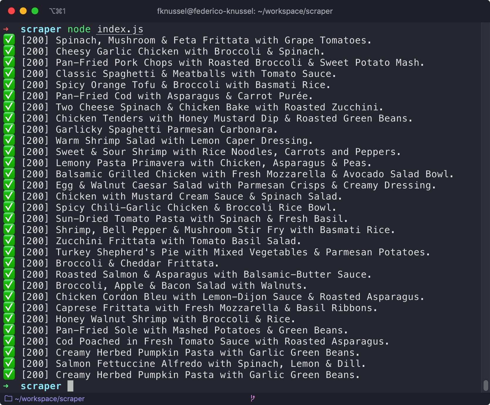

# recipe-scraper

## Prerequisites

-   Node.js (https://nodejs.org/)
-   Yarn (https://yarnpkg.com/)

## Development Tasks

| Command        | Description                                                  |
| -------------- | ------------------------------------------------------------ |
| `yarn install` | Fetch dependencies and build binaries for any of the modules |
| `yarn start`   | Run the app                                                  |
